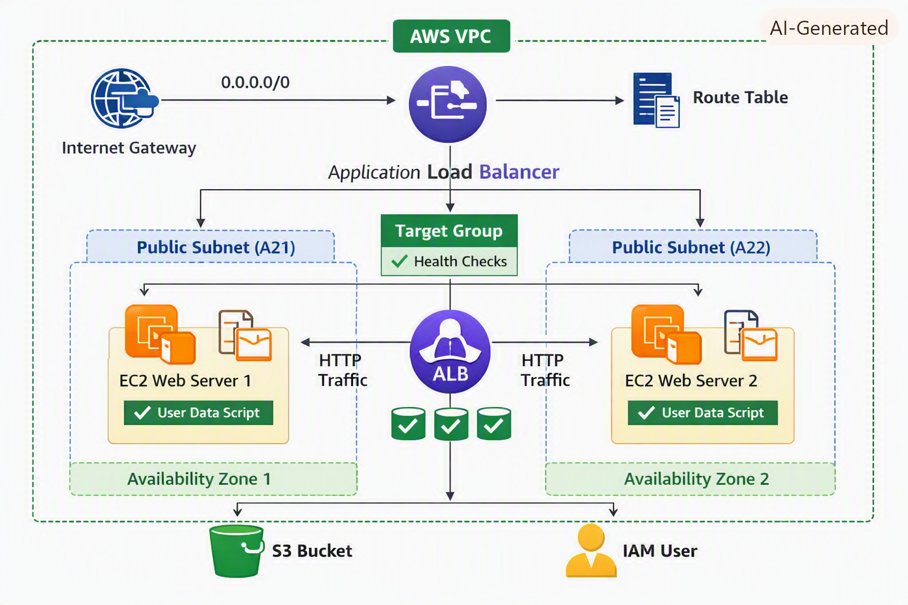

## 📘 Architecture Diagram




# **Creating VPC Using Terraform**

This project demonstrates how to build a complete AWS VPC architecture using Terraform. It includes networking components, security layers, EC2 instances, and an Application Load Balancer — all deployed automatically through Infrastructure as Code (IaC).

---

## **📌 What This Project Builds**

- A custom **VPC**  
- Two **public subnets** across different Availability Zones  
- An **Internet Gateway**  
- A **Route Table** with a default route to the internet  
- A **Security Group** for ALB and EC2  
- Two **EC2 web servers** with user‑data scripts  
- An **Application Load Balancer (ALB)**  
- A **Target Group** with health checks  
- ALB → EC2 **traffic forwarding**  
- S3 bucket (optional component)

---

## **🚀 How It Works**

1. Terraform provisions the VPC and networking resources.  
2. Two EC2 instances are launched in separate subnets.  
3. Each EC2 runs a user‑data script that installs Apache and serves a custom HTML page.  
4. The ALB distributes traffic across both EC2 instances.  
5. Health checks ensure only healthy instances receive traffic.

---

## **🧩 Technologies Used**

- **Terraform** (Infrastructure as Code)  
- **AWS VPC, Subnets, IGW, Route Tables**  
- **EC2 Instances**  
- **Application Load Balancer**  
- **Security Groups**  
- **User‑data scripts (Bash)**

---

## **📁 Project Structure**

```
main.tf
variables.tf
providers.tf
userdata.sh
userdata2.sh
terraform.tfstate
terraform.tfstate.backup
```

---

## **📸 Demo Output**

Each EC2 instance serves a webpage showing:

- Server name  
- Instance ID  
- Custom message  

The ALB DNS distributes traffic between both servers.

---

## **🎯 What This Project Demonstrates**

- Ability to design AWS networking from scratch  
- Understanding of Terraform resource dependencies  
- Real‑world ALB + EC2 architecture  
- Automation using user‑data  
- Clean, modular IaC structure  
- Practical cloud deployment skills

---

## **📦 How to Deploy**

```
terraform init
terraform validate
terraform plan
terraform apply -auto-approve
```

---

## **🌐 Access the Application**

After deployment, Terraform outputs the ALB DNS:

```
http://<your-alb-dns-name>
```

Open it in a browser to see the web servers responding.

---


